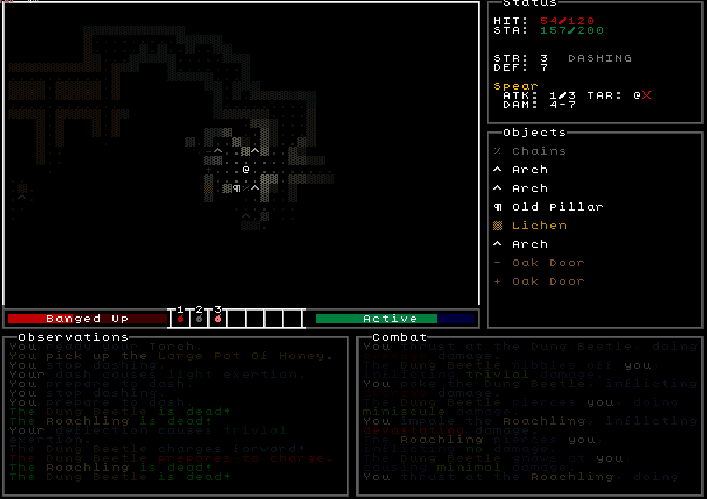

**RoguelikeTutorial - TCOD**

A from-ground-up libtcod rework of my 2017 attempt (using the by now deprecated TDL), with a bit more starting experience and a better of hold of which concepts I want to implement and how to implement them.

Still, this might never turn into a full game, but until then it's a Python playground of various proofs-of-concept.

Example screenshot (28.10.2020):

Based on TStand90's [excellent update]([http://rogueliketutorials.com/libtcod/1]) to the original [Roguelike Tutorial](http://www.roguebasin.com/index.php?title=Complete_Roguelike_Tutorial,_using_python%2Blibtcod)
 on Roguebasin. Shout-out to the fantastic [/r/roguelikedev](https://www.reddit.com/r/roguelikedev/) community as well.